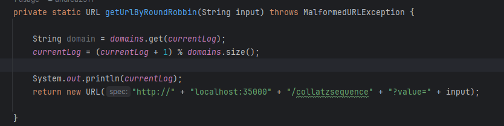
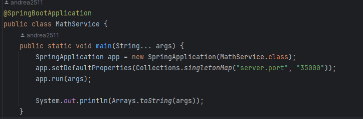
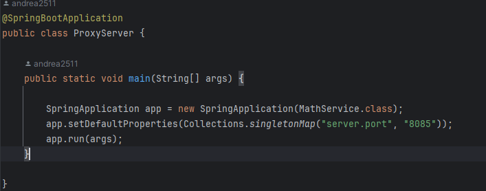

# ParcialAREP2

## Implementación del round robbin

Genera internamente una solicitud get a mathservice que se corre en otro puerto, subiendo a aws se usa con los dominios y un currentLog

## Implementación de MathService

corre por el puerto 35000

## Implementación del ProxyServer

corre por el puerto 8585, llama al roudRobbin para que gestione la maquina donde se correrá el servicio de MathService